# python_study

\[TOC\]

## 目录示意图

### 001.python变量的赋值和打印和获取类型

### 002.python字符串（上）与转义序列

### 003.python字符串（下）

### 004.python指定格式的输出(上)

```
使用%和()
```

### 005.python指定格式的输出(下)

```
使用.format和{}
```

### 006.从键盘输入

```
使用input(s),里面的s会在输入前打印出来作为输入提示.
需要注意的是，使用input得到的输入结果是字符串类型，如果想要获得其他类型的输入
需要把input的结果再强转
```

### 007.标准输入和标准输出

### 008.指定分隔符合行末符号

### 009.计算运算符和赋值运算符

### 010.比较运算符

### 011.逻辑运算符

### 012.运算的优先顺序

```
计算运算符遵循常规计算原则，比如括号内优先，指数优先，先乘除后加减
少部分是从右到左：如**，=
```

### 013.列表(上)

列表的生成方法，列表的元素的类型限制，列表的元素也可以是列表，

列表中元素的访问方法，列表中的元素的更新方法

附加问题：

元组可以是列表的元素吗？

列表中的元素可以重复出现吗？

### 014.列表(下)

### 015.列表操作(上)

如何向列表中添加元素。

如何实现列表的连结。

删除列表中的元素的三种方法。

如何把列表的元素分割赋值给多个变量

### 016.列表操作(中)

### 017.列表操作(下)

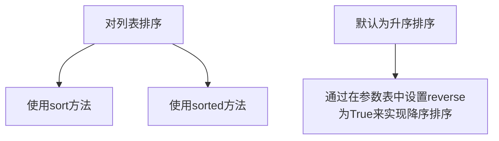

### 018.元组

### 019.字典(上)

### 020.字典(下）

如何覆写字典中的元素：通过后加方括号括键的形式覆写值，

创建字典的几种方式：

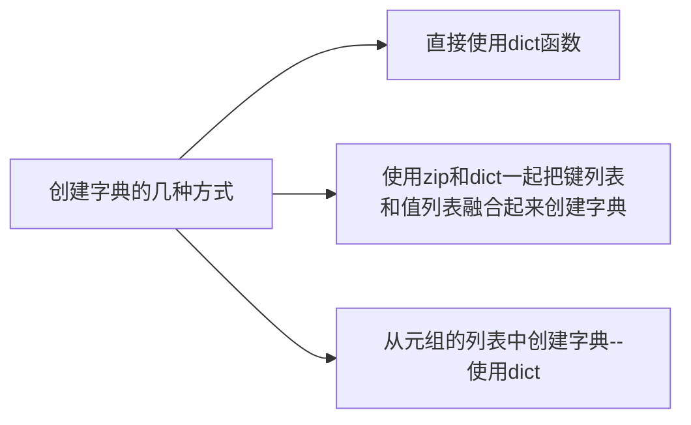

### 021.字典的操作(上）

字典中元素的覆写和添加

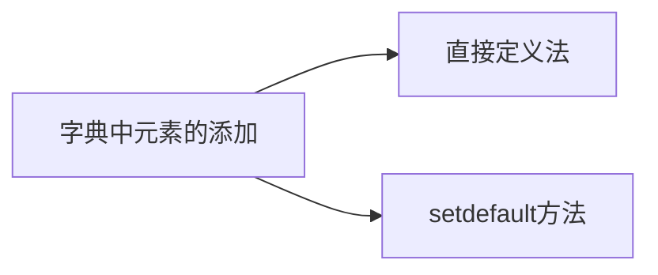

字典中元素的删除，

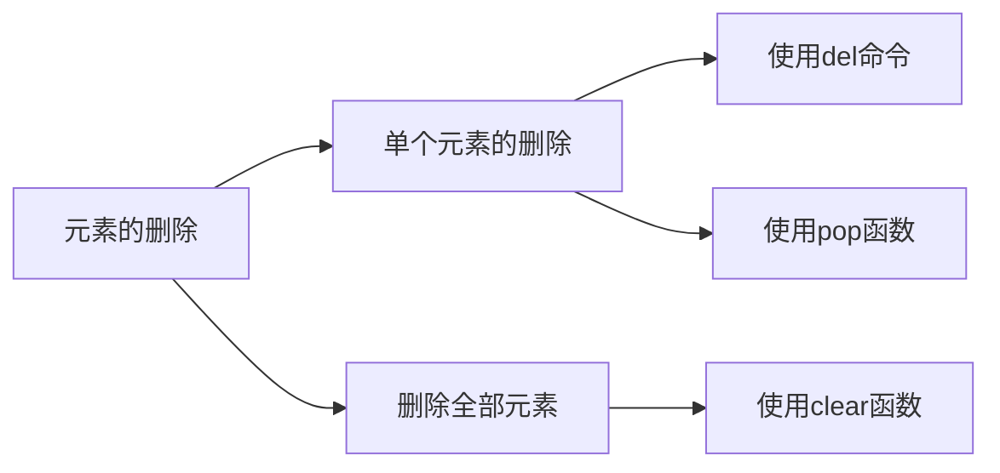

### 022.字典的操作(下）

通过list函数和字典的keys、values、items等函数获得字典的

键列表，值列表，元素(键值对元组)列表

### 023.集合(组):

与列表不同，集合中不能够出现多个拥有相同值的元素。

问题：可以通过下标对集合进行访问吗？不行。

怎样往集合中增加元素？

怎样修改集合中的元素？

### 024.集合的运算:

|集合的运算类型|运算符号|函数|
|-|-|-|
|集合的乘积|&|intersection|
|集合的和|||
|集合的差|-|difference|
|集合的对称差|^|symmetric_difference|
|子集|<=|issubset()|
|真子集|<||
|父集|>=|issuperset()|
|真父集|>||

### 025.对四种“收纳”类型的补充

* 如何复制列表

  对于b=list(1,2)；a=b

  看似把b的列表复制给了a.

  实际上我们可以把a,b都理解成引用类型，它们都只是列表的引用

  a=b，只是把b的指向那个列表的引用复制给了a,实际上a,拥有了同样的引用，指向了同一个列表，指向同一个空间

  不止是列表，实际上四种收纳类型的变量其实存储的都只是指向这些类型的引用

  真正复制它们，需要使用copy函数

### 026.if的用法(上)if的单双分支选择

python里面是通过缩进的层次来实现代码块的分割的。

通过缩进分离出来的代码块可以称为模块

### 027.if的用法(下)if多分支选择和if的嵌套

### 028.for循环(上)

for语句取出列表的值

for-else语句

for语句提取字典的指定内容

问题：

* for访问元组和列表是顺序往后的，访问集合则是乱序的。问，有没办法逆序访问？为什么访问集合是乱序的？

* for循环访问列表元素并作出修改，真的实际上修改了列表的值吗？还是修改了一个局部变量

### 029.for循环(下)

### 030.while的用法

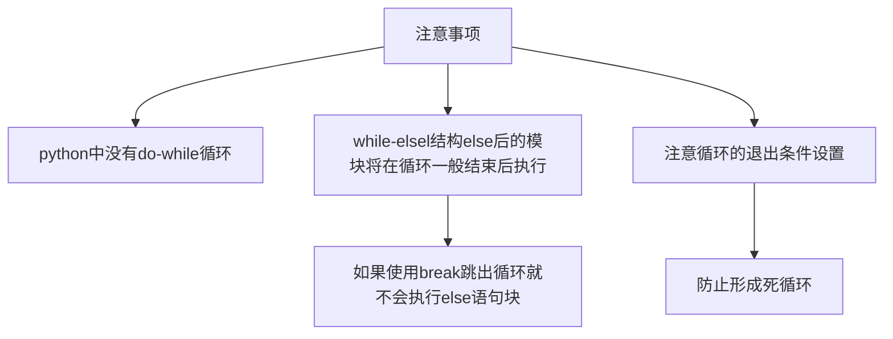

### 031.循环中断

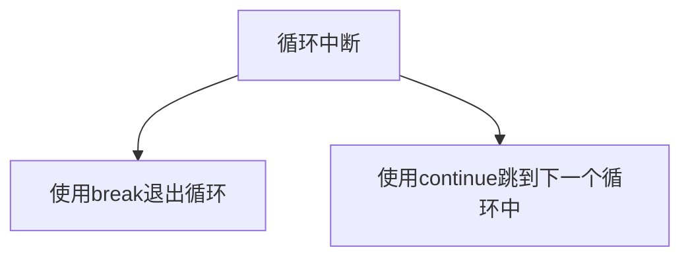

### 032.推导式(上)

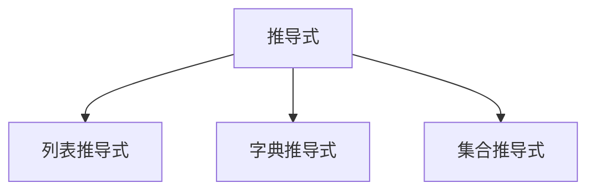

* 列表推导式公式格式如下：

\[ 式 for 变量 in 迭代式的对象  (if 条件式)  \]

* 迭代式(iterable)的对象

  所谓迭代式，是指 "可以将元素按照顺序取出"。像列表、字符串、元组、字典等就具有这样的性质。

  推导式是从迭代式的对象中构造出新的构造类型的式子

问题：为什么集合不是迭代式？因为集合中的元素是无序的

### 033.推导式(下)

* 字典推导式：

  通过迭代式的对象构造出字典类型的式子，公式格式如下：

  \[键:值 for 变量 in 迭代式的对象 (if条件式)\]

* 集合推导式：

  通过迭代式的对象构造出集合类型的式子，公式格式如下：

  \[式 for 变量 in 迭代式的对象 (if条件式)\]

### 034.抽签游戏

### 035.None

在Python里，有一个叫做None的特殊值。它是表示“值不存在“的值，和0、False、空列表是不同的类型。

None是可以设定为NoneType型的唯一值

判定是否为None时不使用==或者!=，而是使用is或is not.同时None值在逻辑运算中被看成是False

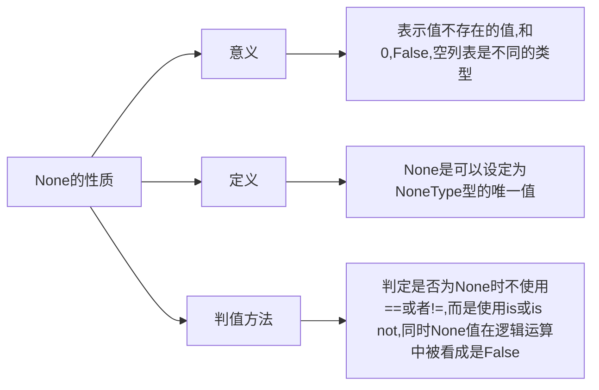

### 036.函数的定义

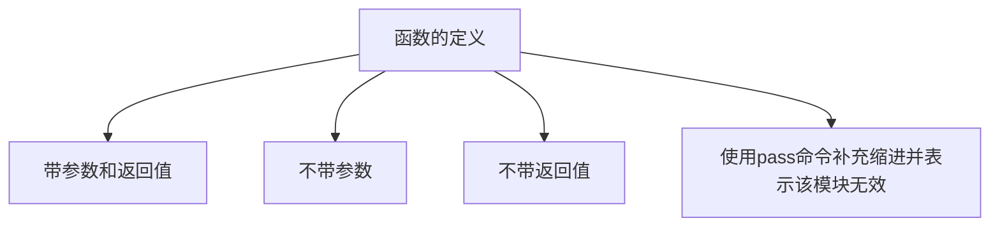

深入理解pass的作用：

有两层作用，一是标示空的内容，比如可以提示之后补充该处代码，类似于java的//TODO,会被编译器显示标识；二是补充因为python必须同时声明并定义的函数特性造成的语法不完整，函数模块是通过缩进标识的，实际编译过程中，注释会被忽略，注释的缩进无法显示，所以需要其他的无功能语句来完成缩进，刚好pass可以方便的补充这点，使得语法结构完整。

附带阅读材料：

[https://mp.weixin.qq.com/s?src=11&timestamp=1649858941&ver=3736&signature=91497AcN3fJGxDBluQ-Nnd5lXT5nxyMsKUMV-VlKDuqmaghQyRf2vqLoJSOr9MbVqkbCquxs\\\*j3XvOlsRBDadGb4Eh5TcwifH8JZ0h7ESXvjIwJi6LujUlSAAybuEpmE&new=1](https://mp.weixin.qq.com/s?src=11&timestamp=1649858941&ver=3736&signature=91497AcN3fJGxDBluQ-Nnd5lXT5nxyMsKUMV-VlKDuqmaghQyRf2vqLoJSOr9MbVqkbCquxs%5C*j3XvOlsRBDadGb4Eh5TcwifH8JZ0h7ESXvjIwJi6LujUlSAAybuEpmE&new=1)

### 037.函数的调用和参数的全局调用

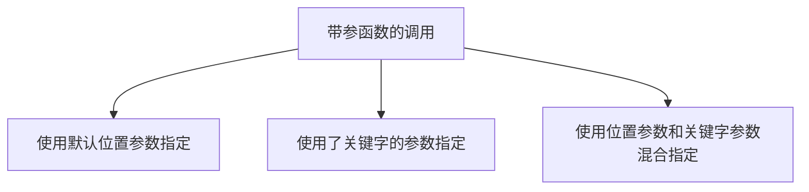

混合指定例子：比如第一个参数使用位置参数指定，后面的参数使用关键字参数指定

**参数的全局调用：**

* 把参数当做元组来接收:

  使用一个\*符号在函数定义中在传入参数的关键字前面修饰，可以使得一系列列参数赋值到元组中。

* 把参数当做字典来接收:

  使用两个\*号指示可以把传入的参数当做字典来接收

  ### 038.默认函数与函数对象和函数嵌套

* 默认函数

  函数可以对从结尾开始到前面连续的若干个参数指定默认变量，在函数调用时指定了默认变量的参数可以省略

* 函数对象:

  函数可以不加（）作为变量值来传递，得到函数名值的变量可以当做该函数使用

* 函数嵌套

  可以在函数中定义函数（在c语言中不行）。内部的函数被称为本地函数，只可以在特定的函数中被使用的函数都可以被认为是本地函数

### 039.无名函数和回调函数

* 无名函数：

  在python中在定义一些简单的函数时可以使用关键字lambda定义和使用无名函数

* 回调函数

  函数可以使用函数作为参数，作为函数参数使用的函数称为回调函数。

问：

1. 使用lambda使用无名函数有什么好处？

[https://mp.weixin.qq.com/s?src=11&timestamp=1649930769&ver=3738&signature=vrpTUjcEzrtPamU4L3SH114O0ta\\\*Wn651zCOkoQFnLcd3zpUCSq5l8QyoAb95TurMvVP\\\*3jmRmoCo\\\*VoxxU8hh\\\*jAZW1ABzUs0xJu0QQ0v6YRopxKUULB8HVepv8Dd4v&new=1](https://mp.weixin.qq.com/s?src=11&timestamp=1649930769&ver=3738&signature=vrpTUjcEzrtPamU4L3SH114O0ta%5C*Wn651zCOkoQFnLcd3zpUCSq5l8QyoAb95TurMvVP%5C*3jmRmoCo%5C*VoxxU8hh%5C*jAZW1ABzUs0xJu0QQ0v6YRopxKUULB8HVepv8Dd4v&new=1)

1. 值得注意的是lambda定义的无名函数中不能使用全局命名空间中的变量

### 040.变量范围

* 本地变量和全局变量

  仅仅在函数中使用的变量称为本地变量，作用范围包括函数内外的变量称为全局变量。

  一般没有特别声明的话，在函数内的变量都是本地变量，作用范围是他第一次出现在函数中的位置的同级模块。

  嵌套函数的本地变量作用范围在嵌套函数之中。

* 非本地变量的更改

  使用global声明某个变量是全局变量，使用nonlocal命令来声明变量并非本地变量

### 041.生成器

* 生成器是指会随着调用次数的不同而返回不同值的一种特别的函数，使用yield定义生成器函数

* 生成器如何传递值？使用send给生成器传递值

### 042.基本字符串操作(上)

从这一章开始，后面开始介绍python的正则表达式以及字符串操作

1. 字符串分割

2. 字符串结合

3. 字符串替换

问题：

1. 字符串替换是否是真的改变了原字符串？

   没有，实际上是新生成了一个相当于原字符串替换后的新字符，然后返回的是新字符

### 043.基本字符串操作(中)

1. 字符串检索

2. 查看字符串是否包含

3. 调查字符串子串个数，count

### 044.基本字符串操作(下)

1. 使用strip去除无效符号

2. 大小写和首单词化

3. 其他类型转化为字符串

4. 获取字符串信息

5. 截取部分字符串

6. 从字符串中取出文字

### 字符串操作总结

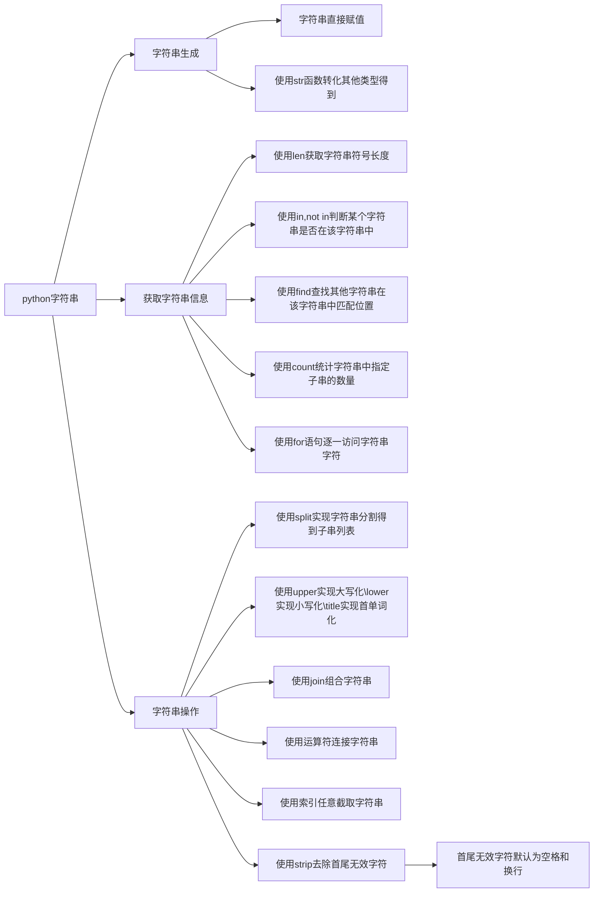

### 045.正则表达式以及正则表达式中的特殊字符

* 模式：利用了正则表达式的模糊表达可以称为模式。能够利用正则表达式得到描述一类具有特定特征的字符串，这个描述可以称为模式。

  比如用《p<半角英文>绘卷》用来表达所有p的英文单词+绘卷的书名，

  《p<半角英文>绘卷》就是模式。

* 正则表达式的特殊字符

  ```mermaid
  graph LR;
  A[特殊字符]-->B[功能表达]
  A-->C[元素表达]
  B-->Ba[表示位置]
  Ba-->ba[使用^表示行的开头]
  Ba-->bb[使用$表示行的结尾]
  B-->Bb[使用单竖符号表示选择]
  B-->Bc[表示重复次数]-->使用花括号,逗号,数字表示重复的次数或者次数重复的区间
  C-->Ca[用.表示除了/以外的任意字符]
  C-->Cb[使用/将特殊字符作字符用]
  C-->Cc[使用方括号定义的字符类表示指定的若干个字符中的一个]
  C-->Cd[使用括号定义字符组表示指定的若干个字符组成的整体]
  ```

### 046.正则表达式匹配(上)

* 使用re.match进行**从头匹配**，使用re.search进行**中途匹配**

  使用group从匹配对象中取出匹配的字符串

  使用start,end，span函数可以分别访问匹配结果的下标信息

  start返回开头下标

  end返回结尾下标+1

  span返回(start,end)

* 通过制作好了进行模式转译的正则表达对象来实现快速匹配

  步骤：

  1. 使用re.compile把字符串制作成进行模式转译的正则表达对象

  2. 然后用正则表达对象来match评价字符串等到匹配结果

  注意：可以加入re.IGNORECASE参数来忽略大小写匹配

### 047.正则表达式匹配(中)

* 最短匹配和最长匹配

  当使用\*,?,+,{n},{n,m}等表示不确定数量的特殊字符时，会默认匹配最长的那个，

  可以在表示不确定数量的特殊字符后面加？表示匹配进行最短匹配（也就是返回所有匹配中最短的第一个）

* 使用re.findall获取所有匹配的字符串的列表

  通过re.findall获取所有符合要求的匹配的字符串的列表，比如所有最短匹配，或者所有最长匹配，看模式串有没有加’?‘指定最短

* 使用re.finditer获得所有符合要求的匹配的列表。

  1. 匹配对象：

     匹配对象是python中的一种数据类型，里面有匹配到的字符串本身，以及其在主串中匹配到的位置。

  2. 使用re.finditer获取到的是符合要求的匹配对象的列表，可以使用匹配对象具有的group,span等函数访问其字符串和匹配到的位置

### 048.正则表达式匹配(下)

* 使用正则表达式进行替换

  使用sub函数

* 使用正则表达式进行分割

  使用split函数

### 049.模块

python怎样编写和使用自己的模块。

* 本地模块，直接导入使用

* 其他模块，要使用sys中

### 050.使用正则表达式的实例

1. 判断密码

2. （非正则表达式）判断中文

### 进入文件处理和例外处理

### 051.文件的开闭和读取

1. 过程：打开文件，读取文件，关闭文件

2. 文件对象的开闭：使用open文件对象流，使用close关闭文件对象流

3. 文件对象读取：

   * 使用for结构读取，使用strip删除末尾换行符

   * 使用readline读取包括换行符的一行

   * 使用read读取指定数目的字节

   * 使用read不指定参数读取全部

   * 使用readlines读取全部文件行到一个列表中（每行都读入换行）

   * 使用list直接把文件对象流转化为字符行列表

注意！：

python默认使用os标准的文字编码gbk简体等读取

问题：

1. 如何使用指定编码格式读取文件

### 052.文件写入

* 使用w重新写入，使用a附加写入

* 使用with结构可以取消f的close操作

### 053.指定文字编码进行读写

使用codecs模块

### 054.例外处理

使用try、except、else进行例外处理

### 055.一些python综合应用的实例和命令行参数的使用过

1. 055文本处理

2. 055b使用命令行参数的打卡器

3. 055c使用命令行参数的加法计算器

### 056.python类的定义和类对象的创建（类的实例化）

* 定义：类是一种数据和函数等处理命令的集合。类中的数据称为类的成员变量，函数称为类的方法

* 类是创建类对象的图纸，类可以实现继承，子类就是相当于在父类的图纸上添加新的内容，或者覆盖原本的内容，于是没有改动的情况下可以直接使用父类中的内容

* 创建类对象的过程称为实例化

* 类的定义与类对象的实例化:

  1. 与一般函数不同，类的方法定义时一定要有至少一个参数，且第一个参数一定要是self.方法中可以通过self调用类的成员

  2. 在类中，可以定义一个特殊的方法\_*init*\_，该方法被称为转换器，会在对象实例化时自动调用，可以用来实现类成员的初始化

* python中类的特点：

  python中类的实例（类对象）创建之后还可以给它定义新的成员变量，也可以删除原有的成员变量

### 057.类的继承

1. python中子类的定义方法，类名后面加一个（），里面填入父类的序列，可以是一个父类，也可以是多个用','隔开的父类，也就是说，在子类类名后面加上一个父类的元组。

2. python支持多继承

问题：(使用057b.py测试）

1. python中多继承后每个父类的转换器都能够使用吗？

   不会，会使用第一个继承的父类的转换器

2. 如果python中父类定义了转换器，子类定义转换器会产生冲突吗？

   不会，子类定义的转换器会覆盖父类的转换器

3. 多个父类之中有同名成员，子类使用哪个？

   子类会使用它继承的父类元组里第一个的成员，也就是会使用它继承的第一个父类的同名成员

4. 子类和父类中有同名变量，会覆盖吗？

   会，子类的同名成员会覆盖父类的同名成员

### 058.方法重写

* 定义：

  什么是方法重写？

  就是在子类中定义一个和其继承的父类中同名的方法，让其覆盖父类的同名方法的过程

* python中存在方法重写，但是不存在方法重载，后面定义的同名方法会覆盖前面的方法

* 超类的方法的引用，可以在子类中使用过super指定调用超类的方法

### 059.属性(性）

* 定义：

  属性是指python中类的能够被外界访问设定和删除的成员变量,

  类中获取某个成员变量的方法叫获取器，设定某个成员变量的方法叫设定器，删除某个成员变量的方法叫删除器，有这三个方法，或者能够实现这三个方法的成员变量就是属性

  一般类中直接定义的变量都是属性，能够在类的外部直接通过类对象名加'.'的方式获得访问，从而实现获取、设定和删除

* 变量的隐藏

  在变量的声明前面加上\_\_前缀，则外界无法直接访问该成员变量

* 属性的定义：

  1. 类中直接定义的成员变量可以直接被外部访问，设定和删除

  2. 使用property方法定义。注意property中输入的参数时可以选择的，比如只输入了获取器参数，那么得到的就是一个只读属性

### 060属性(下):

* 使用了装饰模式的属性的定义方式

  1. 使用@property声明获取器方法，方法名为要获取的变量名

  2. 使用@变量名.setter装饰设定器方法

  3. 使用@变量名.deleter装饰删除器方法

  上述方法均使用变量名作为方法名

### 关于类的成员变量和对象的成员变量的区别

在类体中有定义的变量是类的成员变量，在转换器中才定义的变量，只是类的对象的成员变量

类的成员变量一定是它的类的成员变量，但是对象的成员变量不一定是类的成员变量

### 061.类方法